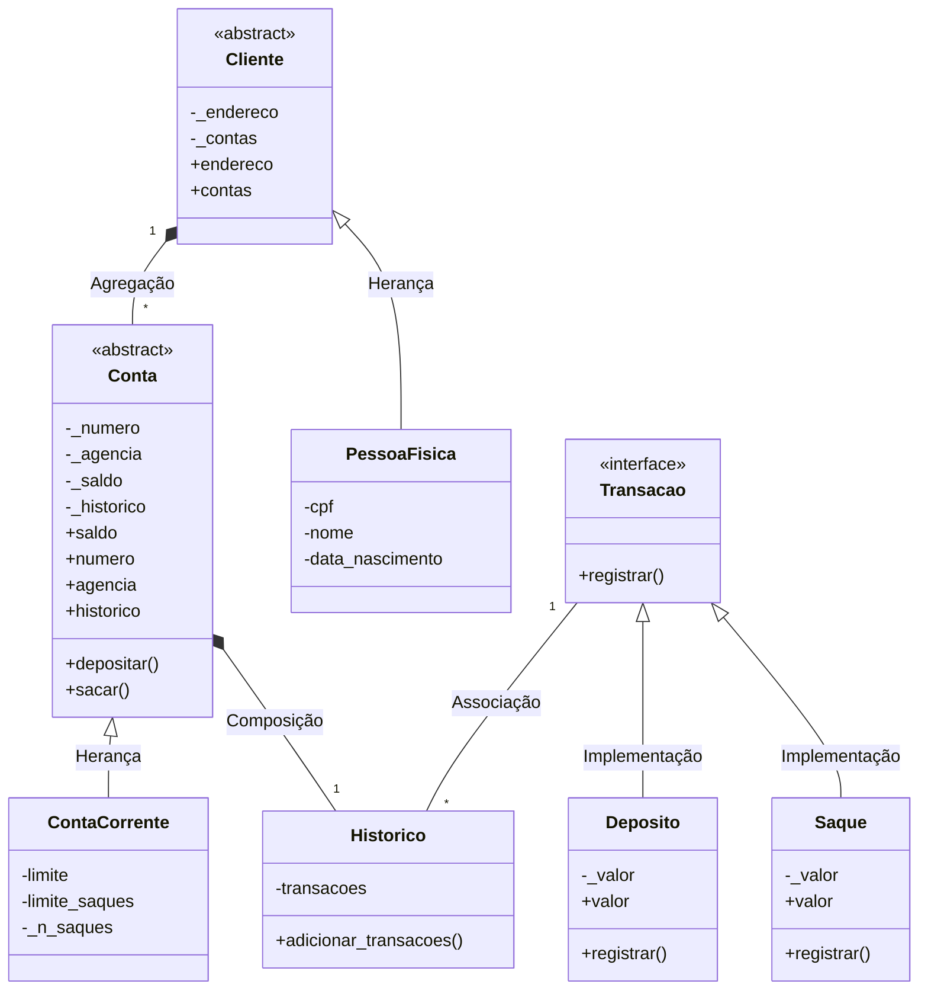

# Sistema Bancário POO

## Descrição do Projeto

Este projeto é uma reimplementação de um sistema bancário simples, originalmente desenvolvido de forma procedural, agora transformado em uma versão orientada a objetos (POO) em Python. Realizada no contexto do BootCamp "Santander 2025 - Back-End com Python" da DIO. Versão original e procedural do código disponível [AQUI](https://github.com/digitalinnovationone/trilha-python-dio/blob/main/01%20-%20Estrutura%20de%20dados/desafio.py)

## Funcionalidades

> Criação de usuários (clientes)

> Abertura de contas correntes

> Operações de depósito

> Operações de saque

> Consulta de extrato

> Dois perfis de acesso: Gerente e Correntista

## Arquitetura


<p></p>

## Como Executar

- Clone o repositório:
```
git clone https://github.com/mathfis/Python-Santander_Bootcamp_2025/POO_Python/
```

- Acesse o diretório
```
cd SistemaBancario_POO
```

- Execute o sistema
```
python usuario_sistema_bancario_v2.py
```

<p></P>

## Funcionalidades Principais
- Exemplo de criação

```
usuario = PessoaFisica(
    endereco="Rua Exemplo, 123",
    cpf="12345678901",
    nome="Fulano de Tal",
    data_nascimento="01/01/1990"
)
```
- Operações Bancárias

| Operação | Método           | Exemplo                     |
|----------|------------------|-----------------------------|
| Depósito | `conta.depositar()` | `conta.depositar(500)`      |
| Saque    | `conta.sacar()`    | `conta.sacar(200)`          |
| Extrato  | `conta.historico`  | `print(conta.historico)`    |

<p></P>

## Estrutura de Arquivos

``` 
SistemaBancario_POO/
├── SistemaBancario_POO_v1.py  # Biblioteca principal
├── usuario_sistema_bancario_v2.py  # Interface
└── README.md                  # Documentação
```
## Requisitos
- Python 3.8+
- Nenhuma dependência externa
<p></P>

## Exemplo de Uso

1) Crie um usuário

```
CPF do novo usuário: 12345678900
Nome: Maria Silva
Data de nascimento: 15/05/1985
Endereço: Av. Principal, 100
```
2) Crie uma conta
```
CPF do usuário: 12345678900
Agência [001]: 
Saldo inicial [0]: 
Limite [500]: 
Limite de saques [3]: 
```
3) Realize um depósito
```
Valor do depósito: 1500
```
4) Consulte o Extrato
```
Extrato da conta 1
Deposito:1500.0
saldo: 1500.0
```
<p></P>

## Melhorias Implementadas

> Encapsulamento de atributos

> Modularização do código

> Registro completo do histórico

> Validações de operações

> Separação de perfis de acesso
<p></P>

## Próximos Passos
> Implementar persistência em banco de dados

> Adicionar autenticação de usuários

> Criar interface gráfica

> Implementar transferências entre contas

<p></p>

## Desenvolvido para o Santander Bootcamp 2025 por Matheus Lara.

[](https://www.linkedin.com/in/laramatheus/)
[](https://github.com/mathfis)